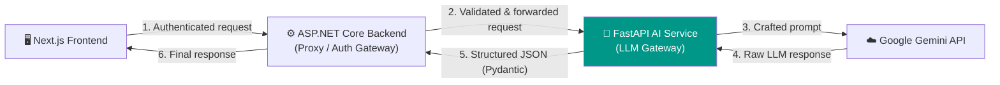
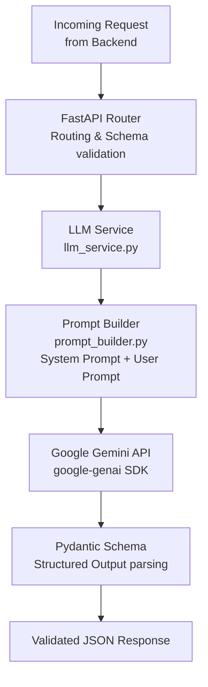
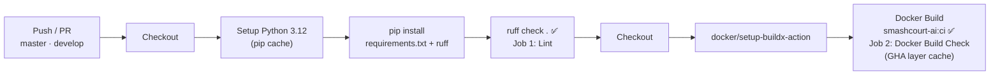

# SmashCourt — AI Service 🤖

[](https://fastapi.tiangolo.com/)
[](https://www.python.org/)
[](https://aistudio.google.com/)
[](https://www.docker.com/)
[](https://opensource.org/licenses/MIT)
[](https://github.com/NguyenThanhTrung-N2T/SmashCourt-AI/actions)

> LLM Gateway của hệ thống SmashCourt — cung cấp Chatbot tư vấn, Gợi ý đặt sân cá nhân hóa và Phân tích kinh doanh thông minh thông qua **Google Gemini API**. Được xây dựng bằng **FastAPI** với Pydantic Structured Outputs, hoạt động hoàn toàn ẩn sau Backend API để đảm bảo bảo mật tuyệt đối.

---

## 🌐 Hệ sinh thái dự án (Project Ecosystem)

SmashCourt được chia làm **3 phân hệ độc lập**, mỗi phân hệ là một repository riêng để tối ưu hóa khả năng phát triển song song và triển khai độc lập:

| Phân hệ | Công nghệ | Repository |
| :--- | :--- | :--- |
| 🖥️ **Frontend (FE)** | Next.js 16, React 19, TailwindCSS v4 | [SmashCourt-FE](https://github.com/NguyenThanhTrung-N2T/SmashCourt-FE) |
| ⚙️ **Backend (BE)** | ASP.NET Core 8, SignalR, Hangfire, PostgreSQL | [SmashCourt-BE](https://github.com/NguyenThanhTrung-N2T/SmashCourt-BE) |
| 🤖 **AI Service** ← *Bạn đang ở đây* | FastAPI, Python 3.12, Google Gemini API | [SmashCourt-AI](https://github.com/NguyenThanhTrung-N2T/SmashCourt-AI) |

---

## 📌 Giới thiệu (Introduction)

**SmashCourt AI Service** là một microservice FastAPI chuyên trách xử lý tất cả các yêu cầu liên quan đến Trí tuệ nhân tạo trong hệ sinh thái SmashCourt.

**Nguyên tắc thiết kế cốt lõi:**

- 🔒 **Security by Design**: AI Service **không bao giờ** được gọi trực tiếp từ Frontend. Mọi yêu cầu phải đi qua Backend API (ASP.NET Core) đóng vai trò proxy an toàn — đảm bảo xác thực, rate limiting và kiểm soát dữ liệu trước khi chuyển đến AI.
- 🎯 **Structured Outputs**: Toàn bộ phản hồi từ Gemini API được định hình thành JSON có cấu trúc rõ ràng thông qua **Pydantic schemas** — Backend có thể parse và sử dụng ngay mà không cần xử lý thêm.
- ✍️ **Prompt Engineering**: Module `prompt_builder.py` tập trung hóa việc xây dựng System Prompt và User Prompt, đảm bảo tính nhất quán, dễ bảo trì và dễ tinh chỉnh.
- ⚡ **Async First**: Toàn bộ endpoint sử dụng `async/await` với Uvicorn ASGI server, hỗ trợ xử lý nhiều yêu cầu đồng thời không blocking.

---

## 🚀 Tính năng cốt lõi (Key Features)

### 1. 🗨️ Chatbot FAQ thông minh (`/api/v1/ai/chat`)

Trợ lý ảo tư vấn cho khách hàng với khả năng trả lời các câu hỏi thường gặp về SmashCourt:

| Endpoint | Method | Mô tả |
| :--- | :---: | :--- |
| `/api/v1/ai/chat` | `POST` | Đàm thoại tự do với AI — nhận câu hỏi & ngữ cảnh, trả về câu trả lời |
| `/api/v1/ai/chat/faq` | `GET` | Trả về danh sách câu hỏi FAQ gợi ý phổ biến |
| `/api/v1/ai/chat/faq-reply` | `POST` | Trả lời nhanh một câu hỏi FAQ được chọn sẵn |

**Ví dụ request:**
```json
POST /api/v1/ai/chat
{
  "message": "Chi nhánh Quận 1 mở cửa đến mấy giờ?",
  "context": {
    "branch_name": "SmashCourt Quận 1",
    "operating_hours": "06:00 - 22:00"
  }
}
```

### 2. 💡 Gợi ý đặt sân cá nhân hóa (`/api/v1/ai/suggest`)

Phân tích lịch sử và thói quen đặt sân của từng khách hàng để đưa ra đề xuất phù hợp nhất:

| Endpoint | Method | Mô tả |
| :--- | :---: | :--- |
| `/api/v1/ai/suggest/booking` | `POST` | Gợi ý sân & khung giờ tối ưu dựa trên lịch sử đặt sân |
| `/api/v1/ai/suggest/profile` | `POST` | Tạo thông báo/lời khuyên cá nhân hóa hiển thị trên trang Profile |

### 3. 📊 Phân tích kinh doanh thông minh (`/api/v1/ai/analytics`)

Công cụ hỗ trợ ra quyết định cho Quản lý chi nhánh với AI tổng hợp insight từ dữ liệu thực tế:

| Endpoint | Method | Mô tả |
| :--- | :---: | :--- |
| `/api/v1/ai/analytics/summary` | `POST` | Tổng hợp insight toàn diện về hiệu suất chi nhánh |
| `/api/v1/ai/analytics/revenue` | `POST` | Phân tích xu hướng doanh thu, phát hiện bất thường |
| `/api/v1/ai/analytics/occupancy` | `POST` | Phân tích tỉ lệ lấp đầy theo sân, giờ, loại ngày — đề xuất điều chỉnh giá |
| `/api/v1/ai/analytics/cancellation` | `POST` | Phân tích nguyên nhân hủy booking — đề xuất cải thiện |

### 4. 🏥 Health Check

| Endpoint | Method | Mô tả |
| :--- | :---: | :--- |
| `/health` | `GET` | Kiểm tra trạng thái hoạt động của service |

---

## 📐 Kiến trúc tổng quan (Overall Architecture)

### Vị trí AI Service trong hệ thống



### Luồng xử lý nội bộ AI Service



---

## 🛠️ Hướng dẫn cài đặt (Installation)

### Yêu cầu hệ thống (Prerequisites)

| Công cụ | Phiên bản tối thiểu | Ghi chú |
| :--- | :--- | :--- |
| [Python](https://www.python.org/downloads/) | `3.12` trở lên | Bắt buộc |
| [Git](https://git-scm.com/) | Bất kỳ | Để clone dự án |
| [Docker](https://www.docker.com/) | Bất kỳ | Tùy chọn — để chạy container |
| Gemini API Key | — | Lấy miễn phí tại [Google AI Studio](https://aistudio.google.com/apikey) |

### Clone và cài đặt

```bash
# 1. Clone repository
git clone https://github.com/NguyenThanhTrung-N2T/SmashCourt-AI.git

# 2. Di chuyển vào thư mục dự án
cd SmashCourt-AI

# 3. Tạo và kích hoạt môi trường ảo (Virtual Environment)
python -m venv .venv

# Windows
.venv\Scripts\activate

# macOS / Linux
source .venv/bin/activate

# 4. Cài đặt tất cả dependencies
pip install -r requirements.txt
```

---

## ▶️ Khởi chạy dự án (Running the Project)

### Development Server (Local)

```bash
uvicorn app.main:app --reload --port 8000
```

| URL | Mô tả |
| :--- | :--- |
| `http://localhost:8000` | API base URL |
| `http://localhost:8000/docs` | Swagger UI — tương tác và kiểm thử API *(chỉ khi `APP_ENV=development`)* |
| `http://localhost:8000/redoc` | ReDoc — tài liệu API dạng đọc |
| `http://localhost:8000/health` | Health check endpoint |

### Production Server

```bash
uvicorn app.main:app --host 0.0.0.0 --port 8000 --workers 4
```

### Khởi chạy với Docker

**Build và chạy trực tiếp:**
```bash
docker build -t smashcourt-ai .
docker run -p 8000:8000 --env-file .env smashcourt-ai
```

**Hoặc với Docker Compose:**
```bash
docker compose up -d --build
```

---

## ⚙️ Cấu hình môi trường (Env Configuration)

```bash
# Sao chép file mẫu
cp .env.example .env
```

Sau đó điền các giá trị thực vào file `.env`:

```env
# ── Google Gemini API ─────────────────────────────
GEMINI_API_KEY=your_gemini_api_key_here
GEMINI_MODEL=gemini-2.5-flash

# ── Application ───────────────────────────────────
# "development" → bật Swagger UI (/docs & /redoc)
# "production"  → tắt Swagger UI (bảo mật endpoint)
APP_ENV=development
```

Bảng mô tả chi tiết:

| Biến | Bắt buộc | Mô tả |
| :--- | :---: | :--- |
| `GEMINI_API_KEY` | ✅ | API Key từ [Google AI Studio](https://aistudio.google.com/apikey) |
| `GEMINI_MODEL` | ✅ | Tên model sử dụng. Khuyến nghị: `gemini-2.5-flash` |
| `APP_ENV` | ✅ | `development` (bật Swagger) hoặc `production` (tắt Swagger) |

> 🔑 **Lấy Gemini API Key**: Truy cập [aistudio.google.com/apikey](https://aistudio.google.com/apikey) → Đăng nhập Google → Create API Key → Copy và dán vào `.env`.

---

## 📂 Cấu trúc thư mục (Folder Structure)

```
SmashCourt-AI/
│
├── app/
│   ├── main.py                      # FastAPI app entry point
│   │                                # - Khởi tạo app, cấu hình CORS
│   │                                # - Include tất cả routers
│   │                                # - Ẩn Swagger khi APP_ENV=production
│   │
│   ├── routers/                     # API Routers — phân nhóm theo nghiệp vụ
│   │   ├── chat_router.py           # /api/v1/ai/chat — Chatbot & FAQ
│   │   ├── suggest_router.py        # /api/v1/ai/suggest — Booking & Profile suggestions
│   │   └── analytics_router.py      # /api/v1/ai/analytics — BI & Insights
│   │
│   ├── models/                      # Pydantic Data Models
│   │   ├── schemas.py               # Schemas cơ bản (chat đơn giản)
│   │   └── ai_schemas.py            # Structured Output schemas cho mọi AI response
│   │
│   └── services/                    # Core Business Logic
│       ├── llm_service.py           # Giao tiếp với Gemini API (google-genai SDK)
│       └── prompt_builder.py        # Xây dựng System Prompt & User Prompt
│                                    # theo từng loại yêu cầu
│
├── .github/
│   └── workflows/
│       └── ci.yml                   # GitHub Actions — Lint (Ruff) + Docker build
│
├── Dockerfile                       # Multi-stage Docker build (python:3.12-slim)
├── docker-compose.yml               # Docker Compose config
├── requirements.txt                 # Python dependencies
├── .env.example                     # Template biến môi trường
└── .gitignore
```

---

## ⚡ CI/CD (GitHub Actions)

Pipeline 2 giai đoạn được định nghĩa trong [`.github/workflows/ci.yml`](https://github.com/NguyenThanhTrung-N2T/SmashCourt-AI/blob/master/.github/workflows/ci.yml):



| Job | Bước | Mục đích |
| :--- | :--- | :--- |
| **Lint (Ruff)** | `ruff check .` | Kiểm tra code style, lỗi cú pháp với Ruff — linter Python cực nhanh |
| **Docker Build** | `docker/build-push-action` (push: false) | Kiểm chứng Dockerfile hợp lệ, tận dụng GHA cache để tăng tốc |

> ℹ️ Job **Docker Build** chỉ chạy sau khi **Lint** thành công (`needs: lint`).

---

## 🤝 Hướng dẫn đóng góp (Contribution Guidelines)

1. **Fork** repository và tạo nhánh từ `develop`:
   ```bash
   git checkout -b feature/improve-booking-prompt
   # hoặc
   git checkout -b fix/analytics-parsing-error
   ```
2. **Viết code** đảm bảo:
   - Mọi response AI đều phải có Pydantic schema tương ứng trong `ai_schemas.py`.
   - Prompt được xây dựng tập trung trong `prompt_builder.py` — không hardcode string trong service.
   - Code tuân thủ **Ruff** linting (`ruff check .` phải pass).
3. **Commit** theo chuẩn [Conventional Commits](https://www.conventionalcommits.org/):
   ```bash
   git commit -m "feat: add cancellation pattern analysis to analytics router"
   git commit -m "fix: handle empty booking history in suggest prompt"
   git commit -m "refactor: centralize gemini client initialization in llm_service"
   ```
4. **Tạo Pull Request** đến `develop` với:
   - Mô tả thay đổi Prompt (nếu có) và lý do cải tiến.
   - Kết quả sample response mới so với response cũ (nếu thay đổi output).

---

## 🗺️ Lộ trình phát triển (Roadmap)

| Trạng thái | Tính năng |
| :---: | :--- |
| ✅ Done | Tích hợp `google-genai` SDK mới nhất (v1.10.0) |
| ✅ Done | Structured Outputs với Pydantic cho tất cả endpoints |
| ✅ Done | 3 nhóm endpoint: Chat, Suggest, Analytics |
| ✅ Done | Swagger UI ẩn/hiện dựa theo `APP_ENV` |
| ✅ Done | CI pipeline — Ruff linting + Docker build check |
| 🔄 In Progress | Response caching cho các analytics request tương tự nhau |
| 📋 Planned | Prompt versioning — theo dõi và A/B test các phiên bản prompt |
| 📋 Planned | Streaming response cho Chatbot (Server-Sent Events) |
| 📋 Planned | Phát hiện bất thường trong hành vi đặt/hủy sân |

---

## 📄 Giấy phép (License)

Phát hành dưới giấy phép **MIT License** — cho phép tự do sử dụng, sao chép, sửa đổi và phân phối cho cả mục đích cá nhân lẫn thương mại.

```text
MIT License

Copyright (c) 2026 Nguyen Thanh Trung — SmashCourt

Permission is hereby granted, free of charge, to any person obtaining a copy
of this software and associated documentation files (the "Software"), to deal
in the Software without restriction, including without limitation the rights
to use, copy, modify, merge, publish, distribute, sublicense, and/or sell
copies of the Software, and to permit persons to whom the Software is
furnished to do so, subject to the following conditions:

The above copyright notice and this permission notice shall be included in all
copies or substantial portions of the Software.

THE SOFTWARE IS PROVIDED "AS IS", WITHOUT WARRANTY OF ANY KIND, EXPRESS OR
IMPLIED, INCLUDING BUT NOT LIMITED TO THE WARRANTIES OF MERCHANTABILITY,
FITNESS FOR A PARTICULAR PURPOSE AND NONINFRINGEMENT.
```

Xem file [`LICENSE`](./LICENSE) hoặc tại [opensource.org/licenses/MIT](https://opensource.org/licenses/MIT).
